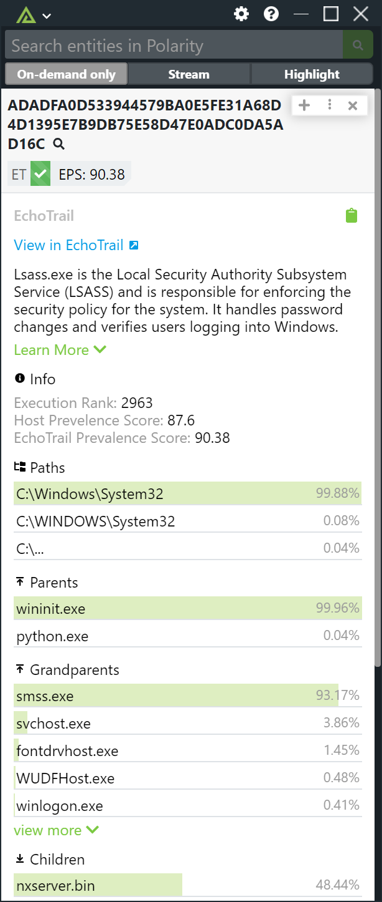
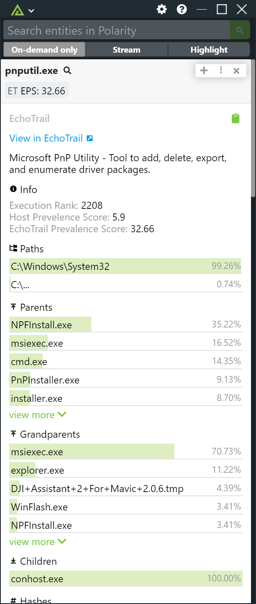

# Polarity EchoTrail Integration

Polarity's EchoTrail integration leverages the EchoTrail Insights REST API to provide data points detailing what processes are, how they typically behave, who wrote them, and Security Intel on how they are used by threat actors.  The integration supports looking up SHA256 hashes as well as file names that end with `.exe`.

Please see [https://www.echotrail.io/](https://www.echotrail.io/) for more information.

|  | 
|------------------------------|----|
| *SHA256 Example*             | * EXE Example* |

## Integration Options

### EchoTrail API Key

API Key for the EchoTrail API

### Show Files that have not been Observed

If checked, the integration will return a 'Not Observed' result for SHA256 hashes and files that have not been observed by EchoTrail.

### Anomalous Process Threshold for SHA256

SHA256 values with an EchoTrail prevalence score below or equal to this value will be flagged as anomalous. Defaults to 20. Set to -1 to disable. This option should be visible to all users. This option is only applicable to SHA256 lookups.

### Common Process Threshold for SHA256

SHA256 values with an EchoTrail prevalence score above or equal to this value will be flagged as a common process. Defaults to 80.  Set to -1 to disable. This option should be visible to all users. This option is only applicable to SHA256 lookups.

## Installation Instructions

Installation instructions for integrations are provided on the [PolarityIO GitHub Page](https://polarityio.github.io/).

## Polarity

Polarity is a memory-augmentation platform that improves and accelerates analyst decision making.  For more information about the Polarity platform please see:

https://polarity.io/
